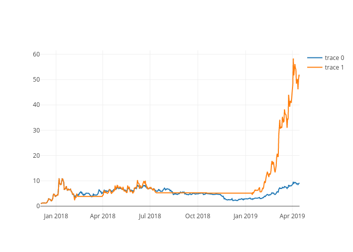
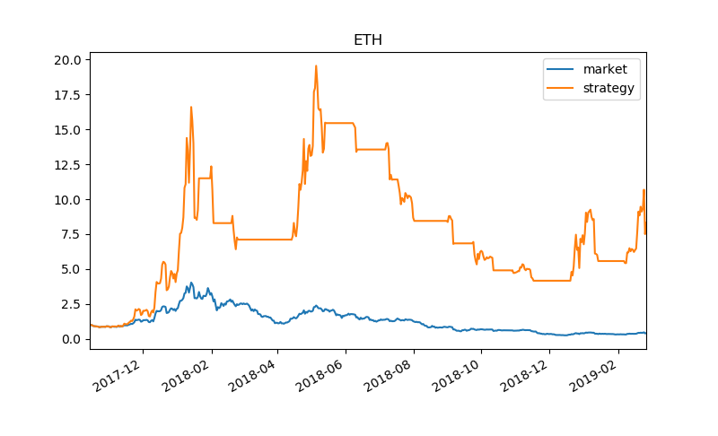
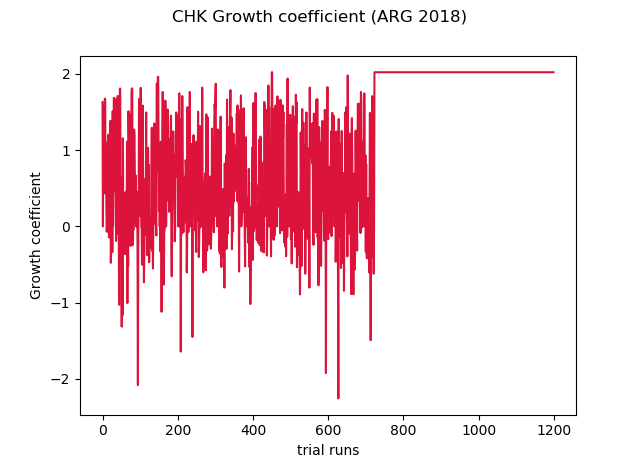

# quant-python
## Quantitative finance with python
#### Andrew Garcia, 2019

Published code _**tech_anlsys.py**_ is an **ADAPTED** script from the codes from _**Python for Finance (Yves Hilpisch, 2014)**_ which show simple technical analysis algorithms for stocks.

Historical Data

Strategy results (Buy-sell-hold regime in red)

Market v. Strategy

Rel. return per run

The figures showed here are the results of an optimization script _**cerberus33.py**_ which integrates _**tech_anlsys.py**_ to a [secret] Monte Carlo algorithm (not pushed here; confidential) which finds optimal backtesting parameters for a certain stock, showing optimal **"BUY/HOLD/SELL"** regimes (step-wise red line in 2nd plot) for a certain trading window.

**Cerberus** the offspring of monsters Echidna and Typhon [Python] with its vicious heads **Buy** **Hold** **Sedl** :)
