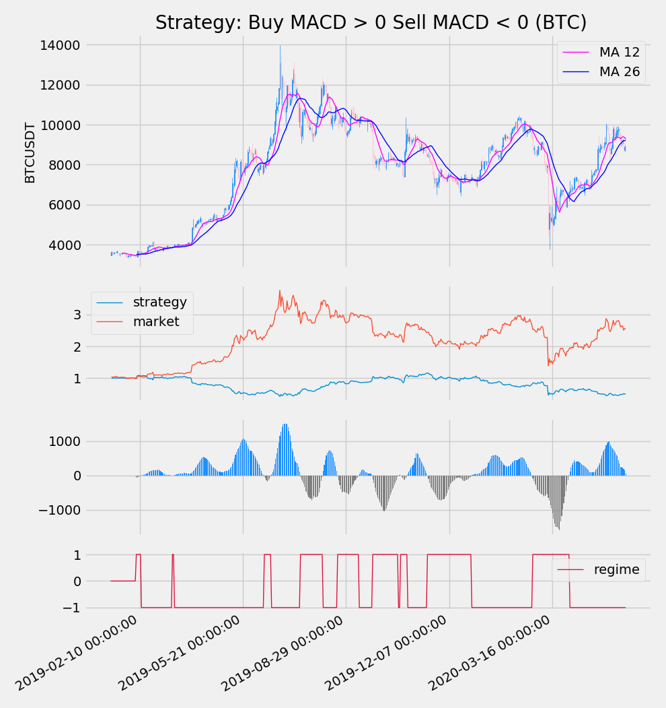

# Quantitative finance with python
## Andrew Garcia, 2019

Copyright 2018 Andrew Garcia

Licensed under the Apache License, Version 2.0 (the "License");
you may not use this file except in compliance with the License.
You may obtain a copy of the License at

    http://www.apache.org/licenses/LICENSE-2.0

Unless required by applicable law or agreed to in writing, software
distributed under the License is distributed on an "AS IS" BASIS,
WITHOUT WARRANTIES OR CONDITIONS OF ANY KIND, either express or implied.
See the License for the specific language governing permissions and
limitations under the License.

## andrewsticks.py

User-friendly script to turn stock market / crypto data to candlesticks (OHLC charts)

</a>

## backtest_simple.py

Published code _**backtest_simple.py**_ is an **ADAPTED** script from the scripts in _**Python for Finance (Yves Hilpisch, 2014)**_ which show simple technical analysis algorithms for stocks. The algorithm has been adapted to import historical data from the web through *working* APIs as the Yahoo API (in Yves' 2014 book) has been deprecated. I have also recently added cryptocurrencies-importing capabilities from Binance (_**binancereader.py**_) and plotly publishing functionality.

## GBM.py

GBM (Geometric Brownian motion) template to model stock prices in the Black–Scholes model
